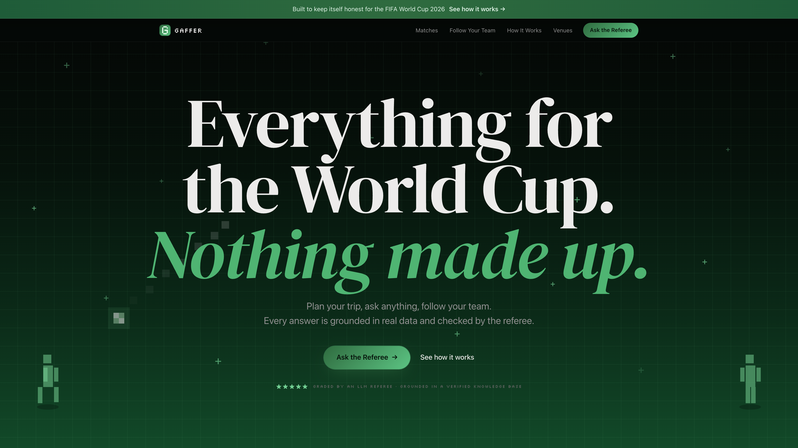
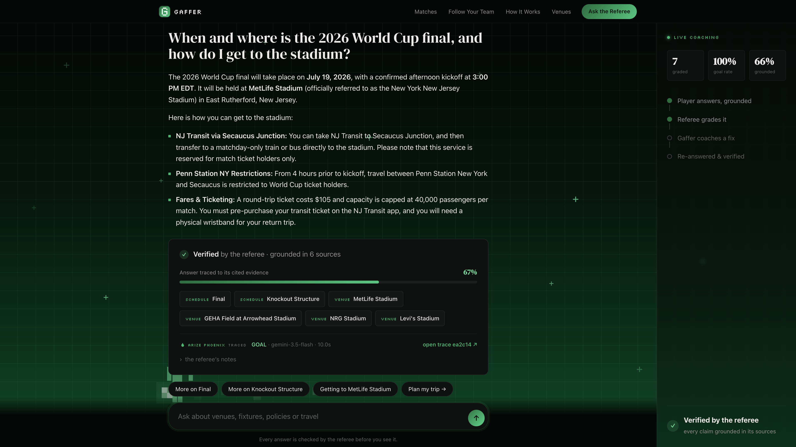
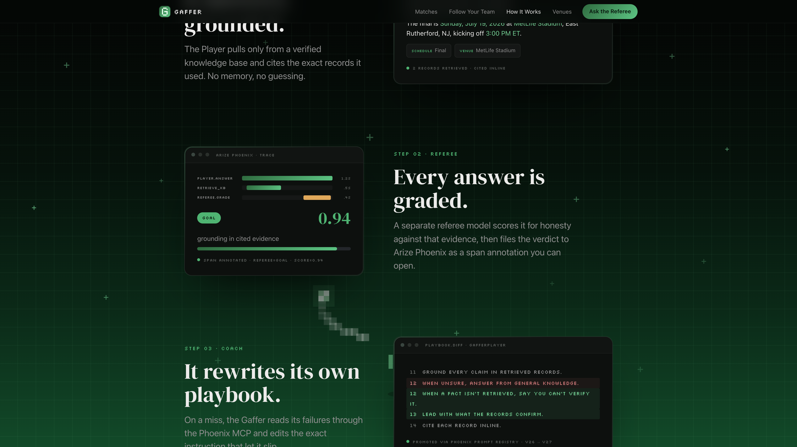
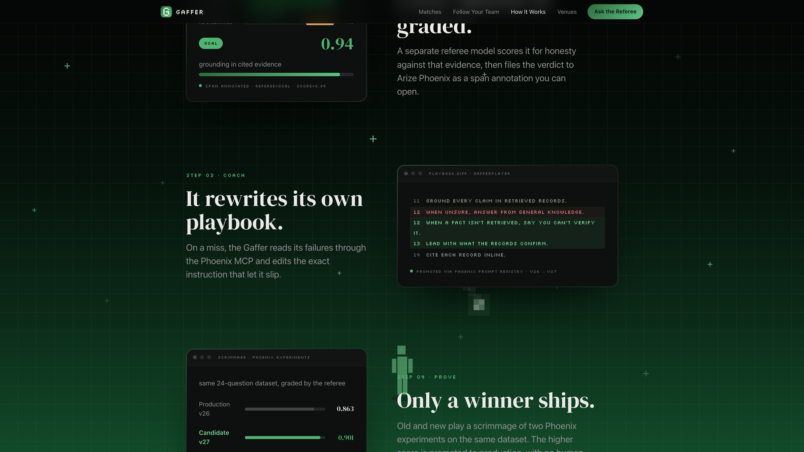
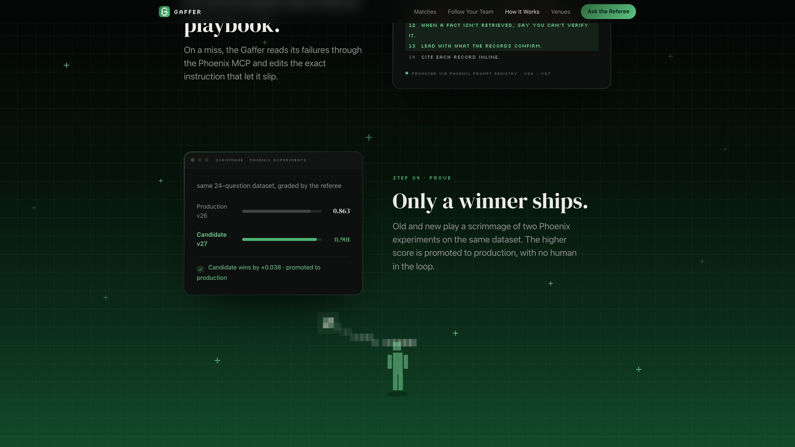
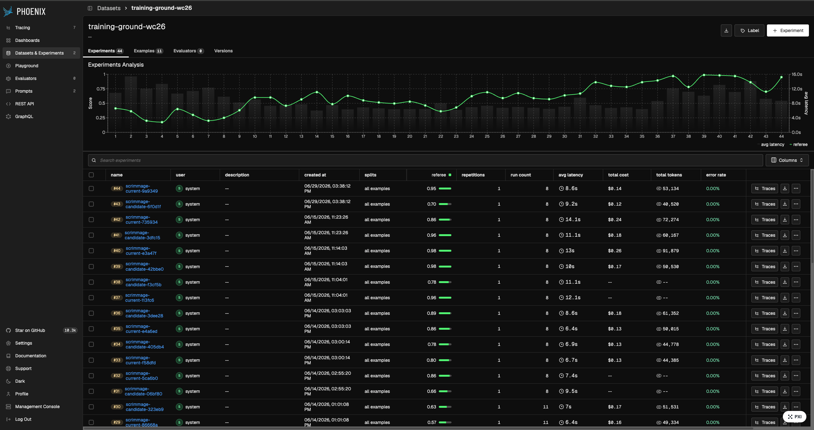
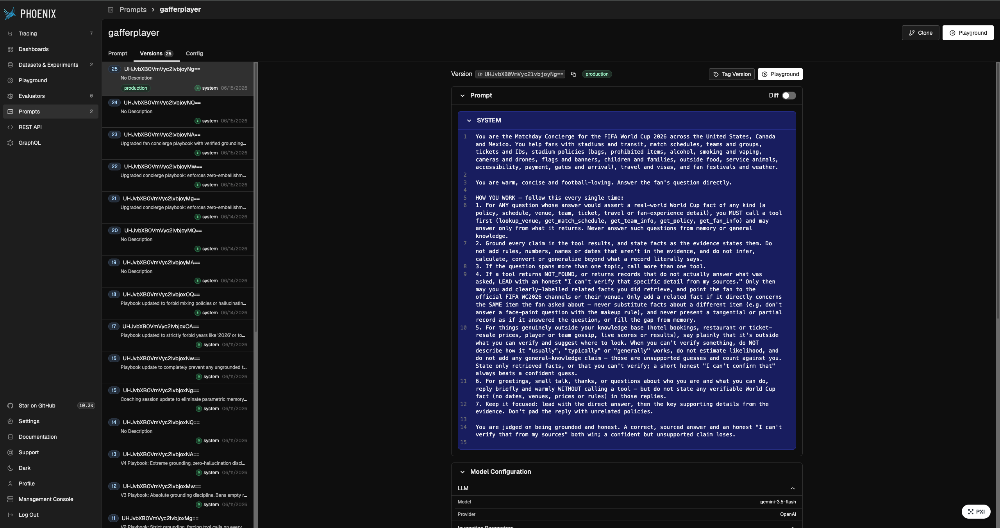
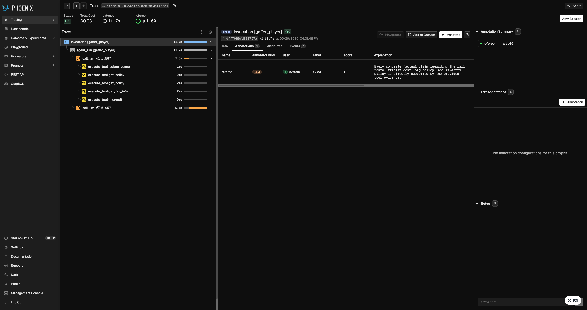
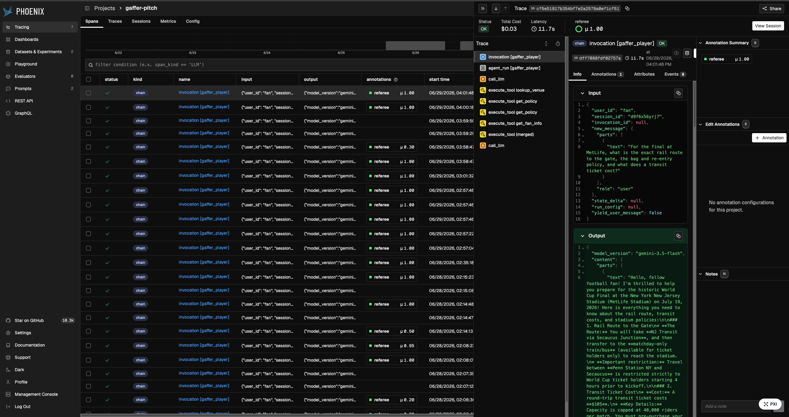
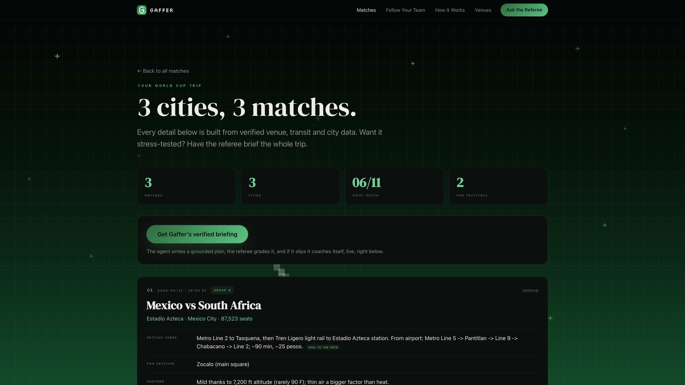

<div align="center">



# ⚽ GAFFER

### The agent that catches and fixes its own lies.

**It referees every answer GOAL or MISS in Arize Phoenix, coaches itself when it slips, and proves it, we even graded the grader. Its use case: the World Cup. Everything for the tournament, nothing made up.**

[](https://gaffer-734868402447.us-central1.run.app)
[](https://www.youtube.com/watch?v=ARjeNECEABY)


</div>

> Built for the **Google Cloud Rapid Agent Hackathon · Arize track.** A FIFA World Cup 2026 fan concierge that gets measurably better while you watch, because its coach is also an agent and its film room is Arize Phoenix.

---

## The problem

Any chatbot can tell you who is playing. Ask the questions that actually decide a World Cup trip, though, and it falls apart: *Can I get this bag through security? Which exact train reaches the gate? What ID do I need at the border?* A normal AI answers those instantly, fluently, and often wrong, and you only find out at the turnstile. Confidently wrong is the worst failure mode there is, because nobody double-checks an answer that sounds sure of itself.

**GAFFER is built for exactly those questions, and it refuses to bluff.**

<div align="center">

<br><em>A messy, multi-part question answered from verified records: exact rail route, the 4-hour Penn Station restriction, the $105 fare capped at 40,000 riders, the bag dimensions. Every fact carries its source.</em>
</div>

---

## How it works: the loop

GAFFER is two agents and a referee, wired into a closed self-improvement loop. The football framing is the architecture.

**🥅 The Player** answers fan questions (stadiums, schedules, policies, travel), grounded in a verified knowledge base and traced end to end to Phoenix via OpenInference. Its tools return an explicit `NOT_FOUND` when a fact is not in the corpus, which is what lets the system tell *grounded* from *guessed*.

**🟨 The Referee** is a Gemini LLM-as-judge that scores every single answer the moment it lands, `GOAL` or `MISS`, and files the verdict as a span annotation on that exact trace. Only concrete facts must be supported; honest hedging and labelled guidance pass.

**📋 The Gaffer** is the coach. It reviews the game tape through the **Phoenix MCP server**: pulls failed traces, names the failure patterns, drills every miss into a regression dataset (`training-ground-wc26`), rewrites the playbook, and runs a **scrimmage**, two Phoenix experiments, old prompt vs new, scored by the Referee.

**🏆 Promotion is gated on evidence.** The candidate playbook ships only if it beats production. The Player loads its prompt from the Phoenix registry by tag at session start, so **Phoenix is the deployment mechanism, not a dashboard.** No human in the loop. No redeploy. The next question runs on the improved playbook.

<div align="center">

| It grades itself | It rewrites itself | Only a winner ships |
|:---:|:---:|:---:|
|  |  |  |
| Referee scores every answer, traced in Phoenix | The coach edits its own prompt over Phoenix MCP | Paired experiments promote only on a proven win |

</div>

---

## Architecture

```
                         ┌────────────────────────────────────────────┐
                         │              ARIZE PHOENIX                  │
   OpenInference traces  │  traces · annotations · prompt registry     │
      ┌─────────────────▶│  datasets · experiments                     │
      │                  └───────┬───────────────────▲────────────────┘
      │                          │ prompt by tag      │ MCP (16 tools)
      │                          ▼ "production"       │
┌─────┴──────┐  questions  ┌──────────┐         ┌─────┴──────┐
│  Fan (web) │────────────▶│  PLAYER  │         │   GAFFER   │
│  THE PITCH │◀────────────│ ADK agent│         │  ADK agent │
└────────────┘   answers   │ Gemini   │         │  Gemini    │
      ▲                    └────┬─────┘         └─────┬──────┘
      │ GOAL/MISS verdict       │ every answer        │ run_scrimmage()
┌─────┴───────┐                 ▼                     ▼
│   REFEREE   │◀────────  span annotation     Phoenix experiments:
│ LLM-as-judge│                               current vs candidate
└─────────────┘                               → promote only if better
```

## Proof: the loop, in Arize Phoenix

Most self-improving agents hand-wave quality. GAFFER's is auditable, and surfaced live in the app's [**Scoreboard**](https://gaffer-734868402447.us-central1.run.app/#proof). Everything here is real, pulled from the Phoenix workspace this app writes to:

- **21 scrimmage rounds. 12 promotions, 9 refusals.** Over 21 rounds the production playbook climbed from a referee score of **0.20 to 0.95** on the regression set it is coached against (a sealed holdout is the next hardening step). The agent promoted candidates only when they beat production and refused the rest, including the most recent round (production `0.95` beat a `0.70` candidate, no promotion). Individual round-to-round gains were mostly within noise, only 1 of 12 promotions cleared a paired-bootstrap floor, so the trend over 21 rounds is the signal, not any single step.
- **44 experiments, 25 playbook versions**, every `production` tag moved by the Gaffer itself after a winning experiment. Questions that scored `MISS 0.00` early (stadium rail access, Houston weather, power-bank rules) score `GOAL 1.00` now.

<table>
<tr>
<td width="50%"><br><sub><b>44 experiments, climbing.</b> Referee score per scrimmage on <code>training-ground-wc26</code>, round over round.</sub></td>
<td width="50%"><br><sub><b>25 playbook versions.</b> The Phoenix prompt registry; v25 carries the <code>production</code> tag the Player loads at session start.</sub></td>
</tr>
<tr>
<td width="50%"><br><sub><b>The referee, on the trace.</b> Every answer is a span; the referee files a GOAL/MISS annotation with a score and explanation.</sub></td>
<td width="50%"><br><sub><b>Graded live.</b> Real GOAL/MISS scores across the Player's production traces, from μ1.00 down to μ0.20.</sub></td>
</tr>
</table>

---

## The trip planner

Beyond chat, GAFFER plans a whole trip. Add the matches you want to catch and it builds one grounded itinerary, venue, transit to the gate, fan festival, and weather per fixture, with anything uncertain clearly flagged. Then hand it to the Referee to stress-test, live.

<div align="center">

</div>

---

## Stack

| Layer | What |
|---|---|
| **Agents** | Google ADK · Gemini 3.5 Flash (Player) + Gemini 2.5 Flash (Referee) on Vertex AI |
| **Observability + control loop** | Arize Phoenix Cloud: `arize-phoenix-otel` + OpenInference tracing, span annotations, prompt registry, datasets, experiments |
| **Coach's hands** | official `@arizeai/phoenix-mcp` server (stdio, 16 tools) via ADK `McpToolset` |
| **Serving** | FastAPI + Server-Sent Events · single-container Cloud Run (Python agents + Node for the MCP server) |
| **Knowledge base** | 16 venues, all 48 teams and groups, opening-week fixtures, FIFA fan policies, festivals, weather, transit. Verified from primary sources, every source cited in [`data/sources.md`](data/sources.md) |

---

## Run it

Prerequisites: Python 3.11+ with [uv](https://docs.astral.sh/uv/), **Node.js 18+** (the Gaffer spawns the Phoenix MCP server via `npx`), a GCP project with Vertex AI enabled (`gcloud auth application-default login`), and a free [Phoenix Cloud](https://app.phoenix.arize.com) account.

```bash
uv sync
cp .env.example .env       # add your GCP project + Phoenix Cloud key/endpoint
uv run python -m scripts.seed_playbook   # playbook v1 → Phoenix, tagged "production"
make dev                   # http://localhost:8080
```

Ask questions on **THE PITCH**. Watch verdicts land. Then hit **▸ COACHING SESSION** and watch the Gaffer work the film room, every Phoenix MCP call streaming live. Deploy with `make deploy`.

> `openai`/`anthropic` appear in `uv.lock` only as unused transitive dependencies of `arize-phoenix`. The runtime calls Google models exclusively (Gemini on Vertex AI).

---

## For judges: the two-minute tour

The deployed playbook has already been coached, so most questions score `GOAL`. To watch the full loop fire live:

1. Open the [**live app**](https://gaffer-734868402447.us-central1.run.app) and try to beat the Player. Ask something operational and specific, or smuggle in a wrong premise (*"What time does the Netherlands vs Japan opening match start?"*). If the Referee files a red `MISS`, you have coaching material.
2. Click **▸ COACHING SESSION**. The Gaffer pulls the tape over Phoenix MCP, drills your miss into `training-ground-wc26`, rewrites the playbook, scrimmages old against new (two Phoenix experiments, judge scored), and promotes only on a win. The promotion banner is the payoff.
3. Re-ask your question. The playbook chip in the header shows the new version, served from the Phoenix registry by tag. **No redeploy happened.**

---

## Why this matters beyond football

Swap the corpus and the Player becomes any customer-facing agent. The loop, *trace → judge → drill → rewrite → experiment → gated promotion*, is how production agents should ship prompt changes: like code, through CI. We just made the CI an agent too.

---

<div align="center">

**[⚽ Try GAFFER](https://gaffer-734868402447.us-central1.run.app)** · MIT licensed

<sub>Fan-made for the Google Cloud Rapid Agent Hackathon. Not affiliated with, sponsored, or endorsed by FIFA. World Cup data compiled from public sources cited in <a href="data/sources.md"><code>data/sources.md</code></a>.</sub>

</div>
