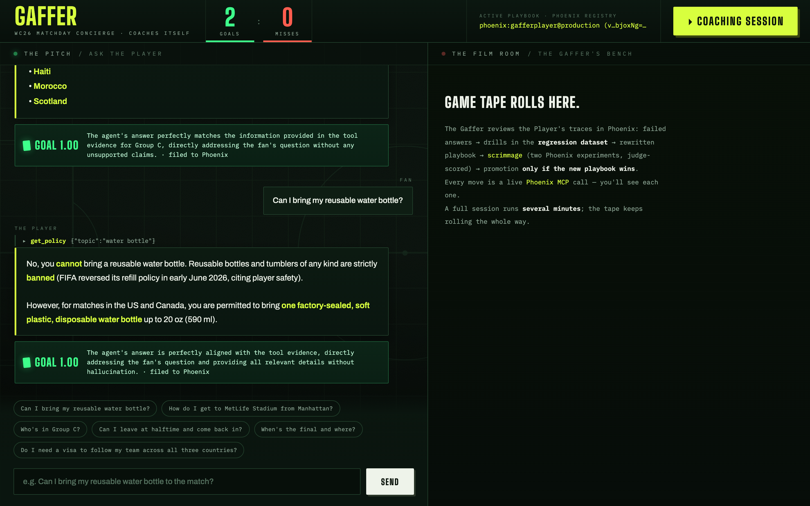

# ⚽ GAFFER — the concierge that coaches itself

**A World Cup 2026 fan concierge that gets measurably better while you watch — because its coach is also an agent, and its film room is Arize Phoenix.**



**Live:** https://gaffer-734868402447.us-central1.run.app

Built for the Google Cloud Rapid Agent Hackathon (Arize track). Submitted on opening day of the 2026 FIFA World Cup.

## The idea

Every agent ships with a flawed prompt. Most teams find out in production and patch by vibes. GAFFER closes the loop instead:

- **The Player** answers real fan questions (stadiums, schedules, policies, travel) — grounded in a verified knowledge base, traced end-to-end to Phoenix via OpenInference.
- **The Referee** (Gemini LLM-as-judge) scores every single answer live — `GOAL` or `MISS` — and files the verdict as a span annotation on the exact trace.
- **The Gaffer** (coach agent) reviews the game tape through the **Phoenix MCP server**: pulls failed traces, names the failure patterns, drills every miss into a regression dataset (`training-ground-wc26`), rewrites the playbook, and runs a **scrimmage** — two Phoenix experiments, old prompt vs new, scored by the Referee.
- **Promotion is gated on evidence.** Only if the candidate playbook beats production does the Gaffer move the `production` tag. The Player pulls its prompt from Phoenix's registry by tag at session start — **Phoenix is the deployment mechanism**, not a dashboard.

No human in the loop. No redeploy. The next fan question runs on the improved playbook, and the regression dataset guarantees old failures stay fixed.

## Architecture

```
                         ┌────────────────────────────────────────────┐
                         │              ARIZE PHOENIX                 │
   OpenInference traces  │  traces · annotations · prompt registry    │
      ┌─────────────────▶│  datasets · experiments                    │
      │                  └───────┬───────────────────▲────────────────┘
      │                          │ prompt by tag      │ MCP (16 tools)
      │                          ▼ "production"       │
┌─────┴──────┐  questions  ┌──────────┐         ┌─────┴──────┐
│  Fan (web) │────────────▶│  PLAYER  │         │   GAFFER   │
│  THE PITCH │◀────────────│ ADK agent│         │  ADK agent │
└────────────┘   answers   │ Gemini   │         │  Gemini    │
      ▲                    └────┬─────┘         └─────┬──────┘
      │ GOAL/MISS verdict       │ every answer        │ run_scrimmage()
┌─────┴──────┐                  ▼                     ▼
│  REFEREE   │◀────────  span annotation     Phoenix experiments:
│ LLM-as-judge│                              current vs candidate
└────────────┘                               → promote only if better
```

**Stack:** Google ADK (Agent Development Kit) · Gemini 3.5 Flash on Vertex AI · Arize Phoenix Cloud (tracing via `arize-phoenix-otel` + OpenInference, prompt registry, datasets, experiments) · official `@arizeai/phoenix-mcp` server (stdio) · FastAPI + SSE · Cloud Run.

## The knowledge base

`data/*.json` — 16 venues, all 48 teams and groups, opening-week fixtures, FIFA fan policies (bag rules, re-entry, ticketing, visas), fan festivals, weather and transit. Researched and verified from primary sources on 2026-06-11; every source cited in [`data/sources.md`](data/sources.md). The corpus doubles as eval ground truth: the tools return an explicit `NOT_FOUND` so the Referee can tell *grounded* from *guessed*.

## Run it

Prerequisites: Python 3.11+ with [uv](https://docs.astral.sh/uv/), **Node.js 18+** (the Gaffer
spawns the Phoenix MCP server via `npx`), a GCP project with Vertex AI enabled
(`gcloud auth application-default login`), and a free [Phoenix Cloud](https://app.phoenix.arize.com) account.

```bash
uv sync
cp .env.example .env       # add your GCP project + Phoenix Cloud key/endpoint
uv run python -m scripts.seed_playbook   # playbook v1 → Phoenix, tagged "production"
make dev                   # http://localhost:8080
```

> Note: `openai`/`anthropic` appear in `uv.lock` only as unused transitive dependencies of
> `arize-phoenix` itself. The runtime calls Google models exclusively (Gemini on Vertex AI).

Ask questions on **THE PITCH**. Watch verdicts land. Then hit **▸ COACHING SESSION** and watch the Gaffer work the film room — every Phoenix MCP call streams live.

Deploy: `make deploy` (Cloud Run, single container: Python agents + Node for the MCP server).

## For judges: the two-minute live tour

The deployed playbook has already been coached, so most questions score GOAL. To watch the
full loop fire live:

1. Open the [live app](https://gaffer-734868402447.us-central1.run.app) and ask something the
   knowledge base cannot support, for example "Which celebrities will attend the final?" or a
   question with a wrong premise. Watch the Referee file a red MISS to Phoenix.
2. Click **▸ COACHING SESSION**. A full session runs three to six minutes: the Gaffer pulls
   the tape over Phoenix MCP, drills your miss into `training-ground-wc26`, rewrites the
   playbook, scrimmages old against new (two Phoenix experiments, judge scored), and promotes
   only on a win. The promotion banner is the payoff.
3. Re-ask your question. The playbook chip in the header shows the new version, served from
   the Phoenix prompt registry by tag. No redeploy happened.

The [demo video](https://www.youtube.com/watch?v=ARjeNECEABY) shows the same arc in 2:24 if
you prefer to watch one we ran on opening day.

## Why this matters beyond football

Swap the corpus and the Player becomes any customer-facing agent. The loop — *trace → judge → drill → rewrite → experiment → gated promotion* — is how production agents should ship prompt changes: like code, through CI. We just made the CI an agent too.

## License

MIT

---

*Fan-made demo for the Google Cloud Rapid Agent Hackathon. Not affiliated with, sponsored or
endorsed by FIFA. World Cup data compiled from public sources cited in `data/sources.md`.*
